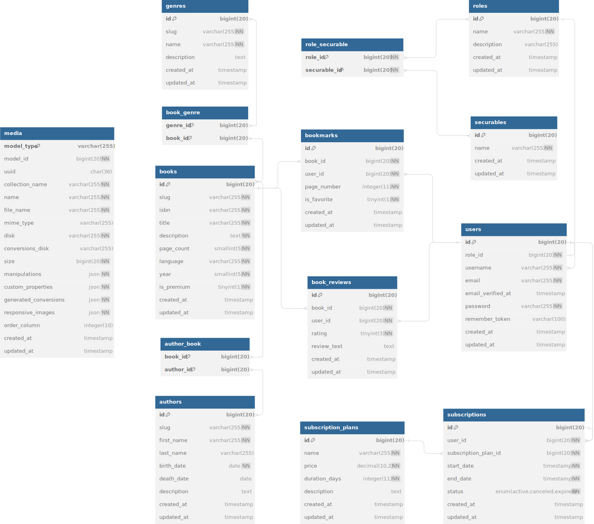
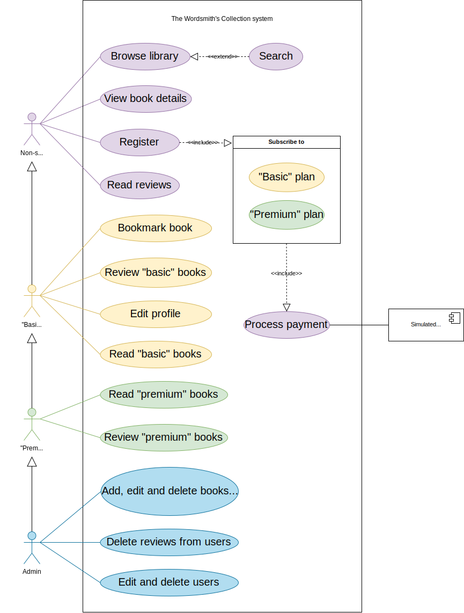

<div id="top"></div>

<!-- PROJECT SHIELDS -->
<!--
*** I am using markdown "reference style" links for readability.
*** Reference links are enclosed in brackets [ ] instead of parentheses ( ).
*** See the bottom of this document for the declaration of the reference variables
*** for contributors-url, forks-url, etc. This is an optional, concise syntax you may use.
*** https://www.markdownguide.org/basic-syntax/#reference-style-links
-->

<!-- PROJECT LOGO -->
<br />
<div align="center">
    
    <h1 align="center">The Wordsmith's Collection</h1>
    <p align="center">A website with a SaaS model that allows users to access a curated library of the most important literary works in history.</p>
    <p>
      <a href="https://github.com/HenestrosaDev/the-wordsmiths-collection/stargazers">
        
      </a>
      <a href="https://github.com/HenestrosaDev/the-wordsmiths-collection/graphs/contributors">
        
      </a>
      <a href="https://github.com/HenestrosaDev/the-wordsmiths-collection/issues">
        
      </a>
      <a href="https://github.com/HenestrosaDev/the-wordsmiths-collection/pulls">
        
      </a>
      <a href="https://github.com/HenestrosaDev/the-wordsmiths-collection/blob/main/LICENSE">
        
      </a>
    </p>
  <p>
    <a href="https://github.com/HenestrosaDev/the-wordsmiths-collection/issues/new/choose">
      Report Issue
    </a> 
    · 
    <a href="https://github.com/HenestrosaDev/the-wordsmiths-collection/issues/new/choose">
      Request Feature
    </a> 
    · 
    <a href="https://github.com/HenestrosaDev/the-wordsmiths-collection/discussions">
      Ask Question
    </a>
  </p>
  <p>
    🇬🇧 English | <a href="https://github.com/HenestrosaDev/the-wordsmiths-collection/blob/main/docs/es/README.md/">🇪🇸 Español</a>
  </p>
</div>

[](https://youtu.be/nN5XyJb1UYE)
>Video in Spanish with English subtitles explaining the main features of the website.

<!-- TABLE OF CONTENTS -->

## Table of Contents

- [About the Project](#about-the-project)
  - [Built With](#built-with)
  - [Entity-Relationship Model](#entity-relationship-model)
  - [Relational Model](#relational-model)
  - [Use Cases](#use-cases)
- [Getting Started](#getting-started)
  - [Prerequisites](#prerequisites)
  - [Steps](#steps)
- [Notes](#notes)
- [Authors](#authors)
- [License](#license)

<!-- ABOUT THE PROJECT -->

## About the Project

**The Wordsmith's Collection** is a subscription-based website (SaaS) that allows users to access a curated library of the most important literary works in history. Subscribed users will be able to read and review the books available for their subscription plan. Each book, genre and author has detailed descriptions to provide synopsis, subject matter and bibliography information, respectively.

In order to access the service, users must register and enter a credit card for payment. Note that **no payments are actually made**, as the site only verifies that the credit card is valid. To actually use this feature, you should implement a payment gateway provider such as Redsys or Stripe.

There are two subscription plans:

- **Basic**: Can read and review all books except those marked **Premium**.
- **Premium**: Can read and review the entire library, including **Premium** books.

The website has three types of users:

- **Non-subscriber visitor**: Cannot read books or write reviews, but can see the available library and posted reviews.
- **Subscriber**: Registered user who pays a monthly/annual fee to read books. Can be **Basic** or **Premium**.
- **Administrator**: A user who has all the features of a subscriber plus the ability to add, edit, and delete books, genres, and authors. They can also edit and delete users, and delete reviews.

<details>
  <summary>Screenshots</summary>

  <p align="center">
    
  </p> 
  
  <p align="center">
    
    &nbsp;
    
  </p> 

  <p align="center">
    
    &nbsp;
    
  </p> 

  <p align="center">
    
    &nbsp;
    
  </p>

  <p align="center">
		
  </p> 
  <br>
</details>

<!-- BUILT WITH -->

### Built With

- [Laravel](https://github.com/laravel/laravel): PHP framework.
- [TailwindCSS](https://tailwindcss.com/docs/guides/laravel): CSS framework.
- [Vue.js 3](https://vuejs.org/): JavaScript framework.
- [Inertia.js](https://inertiajs.com/): Enables the creation of fully client-side rendered, single-page applications without the complexity of modern SPAs.
- [drawio.com](https://drawio.com): Tool used to create the diagrams.
- [Flowbite](https://flowbite.com): Open-source UI component library built on top of Tailwind CSS. Used for Nav dropdowns and tabs.
- [PDF.js](https://mozilla.github.io/pdf.js/): Library for rendering PDFs.
- [Spatie/laravel-medialibrary](https://spatie.be/docs/laravel-medialibrary/v11/introduction): Associates files with Eloquent models.
- [uuid](https://www.npmjs.com/package/uuid): JavaScript package to generate unique UUIDs for the alerts.
- [cviebrock/eloquent-sluggable](https://github.com/cviebrock/eloquent-sluggable): Creates unique slugs for Eloquent models in Laravel.
- [jpkleemans/vite-svg-loader](https://github.com/jpkleemans/vite-svg-loader): Vite plugin to load SVG files as Vue components.
- [laravel-validation-rules/credit-card](https://github.com/laravel-validation-rules/credit-card): Credit card validation package for Laravel.
- [@vueuse/core](https://github.com/vueuse/vueuse): Collection of essential Vue Composition Utilities. Used for infinite scrolling with `useIntersectionObserver` and `useDebounceFn`.
- [@vuepic/vue-datepicker](https://vue3datepicker.com/): Datepicker component for Vue 3.
- [xiCO2k/laravel-vue-i18n](https://github.com/xiCO2k/laravel-vue-i18n): Internationalization for Vue and Laravel.
- [Terms and Conditions generator](https://www.termsandconditionsgenerator.com): Self-explained

<!-- ENTITY-RELATIONSHIP MODEL -->

### Entity-Relationship Model

<div align="center">
  <picture>
    <source 
      srcset="docs/en/light/entity-relationship-diagram.svg"
      media="(prefers-color-scheme: light)"
    />
    <source 
      srcset="docs/en/dark/entity-relationship-diagram.svg"
      media="(prefers-color-scheme: dark)"
    />
    
  </picture>
</div>

<!-- RELATIONAL MODEL -->

### Relational Model

<div align="center">
  <picture>
    <source 
      srcset="docs/common/light/relational-model.svg"
      media="(prefers-color-scheme: light)"
    />
    <source 
      srcset="docs/common/dark/relational-model.svg"
      media="(prefers-color-scheme: dark)"
    />
    
  </picture>
</div>

<!-- USE CASES -->

### Use Cases

<div align="center">
  <picture>
    <source 
      srcset="docs/en/light/use-cases.svg"
      media="(prefers-color-scheme: light)"
    />
    <source 
      srcset="docs/en/dark/use-cases.svg"
      media="(prefers-color-scheme: dark)"
    />
    
  </picture>
</div>

<p align="right">(<a href="#top">back to top</a>)</p>

<!-- GETTING STARTED -->

## Getting Started

### Prerequisites

Ensure you have PHP, Git, Composer, npm, and Laravel installed on your local machine. If not, you can download and install them from the official websites:

- [PHP](https://www.php.net/downloads.php)
- [Git](https://git-scm.com/downloads)
- [Composer](https://getcomposer.org/download/)
- [npm](https://www.npmjs.com/package/download)
- [Laravel](https://laravel.com/docs/9.x/installation) (install globally using Composer)

### Steps

1. Use `git` to clone the Laravel project repository to your local machine. Open your terminal or command prompt and run:
   ```shell
   git clone https://github.com/HenestrosaDev/the-wordsmiths-collection.git
   ```
2. Navigate to the project directory using the `cd` command. For example:
   ```shell
   cd /path/to/the-wordsmiths-collection`
   ```
3. Install Composer dependencies running the following command:
   ```shell
   composer install
   ```
4. Install npm dependencies running the following command:
   ```shell
   npm install
   ```
5. Create a `.env` file, as Laravel uses environment variables stored in a `.env` file for configuration. Duplicate the `.env.example` file provided with the project and rename it to `.env`:
   ```shell
   cp .env.example .env
   ```
   Edit it to set the correct configuration for your database.<br>
   <br>
6. Generate an application key, required for security. Generate it using Artisan:
   ```shell
   php artisan key:generate
   ```
7. Run database migrations to set up the database tables:
   ```shell
   php artisan migrate
   ```
8. Start the development server by running this command:
   ```shell
   php artisan serve
   ```

You can enable hot refresh with Vite by running the command `npm run dev`. Note that you'll need to open the URL provided by Artisan to enjoy this feature, not the one provided by Vite.

<p align="right">(<a href="#top">back to top</a>)</p>

<!-- NOTES -->

## Notes

- Use a [credit card generator](https://www.creditcardvalidator.org/generator) to fake a payment.

<!-- ROADMAP -->

<!--
## Roadmap

- [ ] To do

You can propose a new feature creating an [issue](https://github.com/HenestrosaDev/the-wordsmiths-collection/new/choose).
-->

<!-- AUTHORS -->

## Authors

- José Carlos López Henestrosa ([HenestrosaDev](https://github.com/HenestrosaDev))

<!-- LICENSE -->

## License

Distributed under the MIT License. See [`LICENSE`](https://github.com/HenestrosaDev/the-wordsmiths-collection/blob/main/.github/LICENSE) for more information.

<p align="right">(<a href="#top">back to top</a>)</p>
